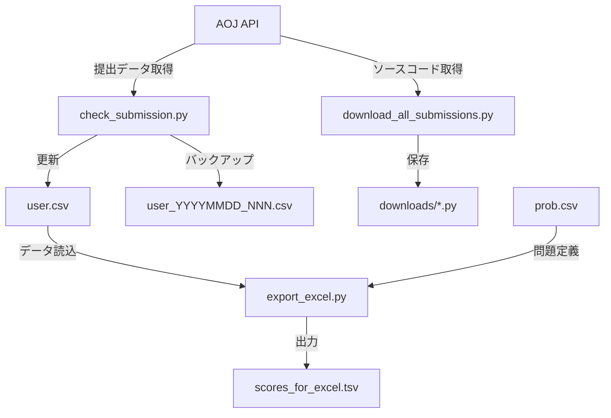

# System Patterns

## アーキテクチャ設計

### データフロー


## データ管理パターン

### 1. ファイル命名規則
- バックアップファイル: `user_YYYYMMDD_NNN.csv`
- ダウンロードファイル: `学籍番号_問題ID.py`
- 出力ファイル: `scores_for_excel.tsv`

### 2. データ構造
```
user.csv:
  - 学籍番号,姓,名,AOJユーザーID
  - 各問題につき3列：
    - スコア
    - 提出日時
    - judgeId

prob.csv:
  - 1行目: カンマ区切りの問題ID
  - 例: ITP1_1_A,ITP1_1_B,ITP1_1_C

scores_for_excel.tsv:
  - タブ区切り形式
  - ヘッダー: 学籍番号,氏名,問題1スコア,問題1提出日時,...
  - 日時形式: YYYY/MM/DD HH:MM:SS
```

## エラー処理パターン

### 1. データ検証
- スコアの範囲チェック（0-100）
- 日時形式の正規化
- 未提出状態の適切な処理

### 2. 例外処理
```python
try:
    # データ処理
except (ValueError, TypeError, OSError):
    # エラー処理
```

### 3. データバックアップ
- 更新前の自動バックアップ
- 一意なファイル名による上書き防止
- バックアップ履歴の保持

## セキュリティパターン

### 1. 個人情報保護
- .gitignoreによる機密ファイル除外
- サンプルファイルでの情報マスク
- バックアップファイルの適切な管理

### 2. アクセス制御
- APIアクセスの適切な制限
- ローカルファイルの権限管理
- エラーメッセージでの情報制限

## 保守性パターン

### 1. モジュール分離
- 機能ごとの独立したスクリプト
- 共通処理の関数化
- 設定値の外部ファイル化

### 2. データ正規化
- clean オプションによるデータ修正
- フォーマットの一貫性維持
- 不正データの自動検出と修正
